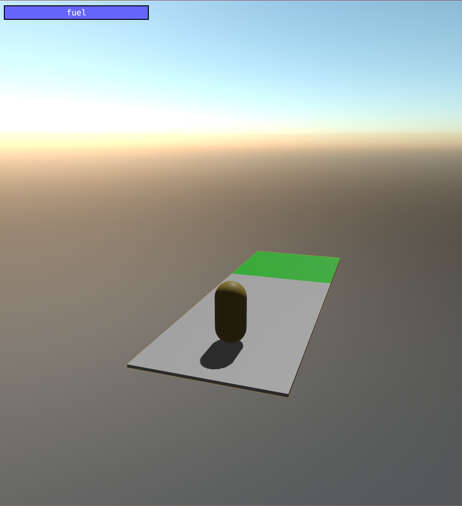
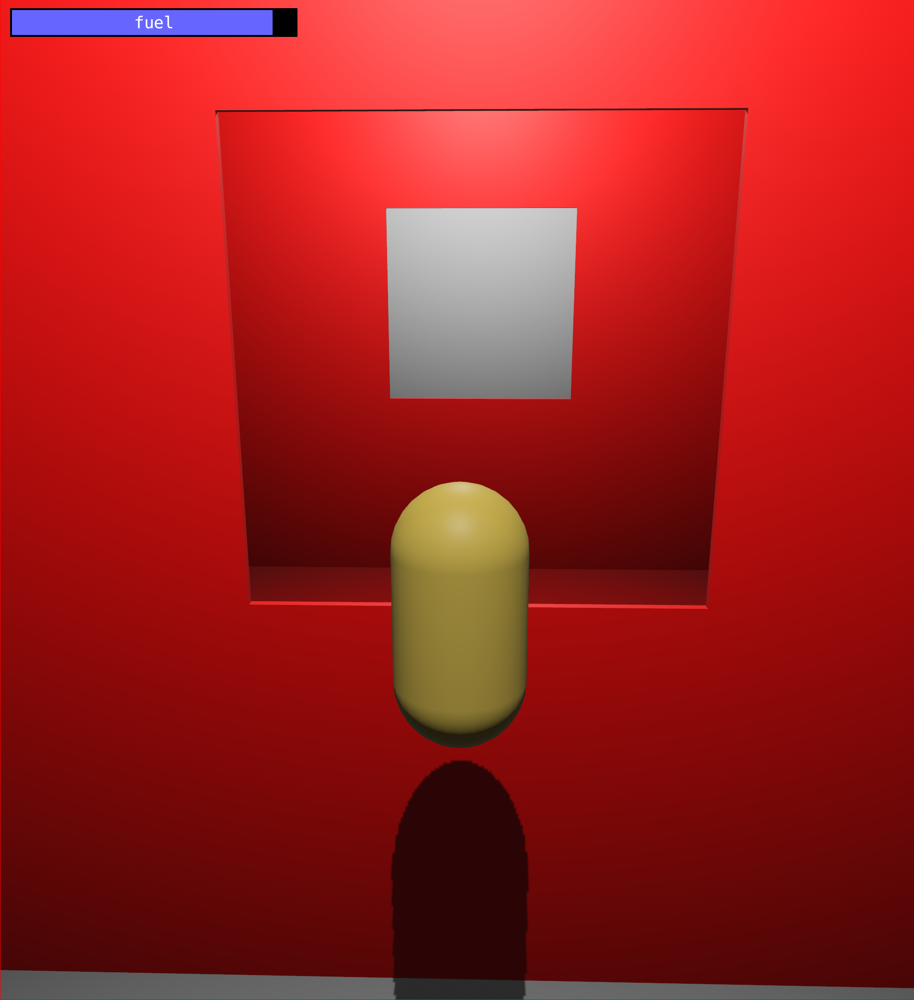
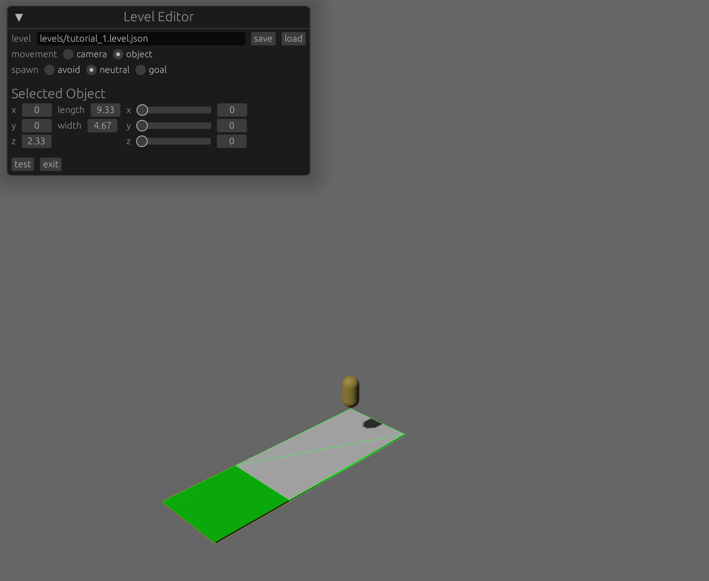

# `hover-pill`

A game I made to learn the [Bevy](https://bevyengine.org/) game engine. You fly a capsule-shaped
object through a series of obstacles to reach a goal.

  

My focus for this project was gameplay design and programming. I left all the "cool" stuff, like
rendering and physics, to third-party libraries:

* Graphics - `bevy_pbr` (included in [`bevy`](https://github.com/bevyengine/bevy))
* Physics - [`bevy_rapier3d`](https://github.com/dimforge/bevy_rapier)
* Skybox - [`bevy_atmosphere`](https://github.com/JonahPlusPlus/bevy_atmosphere)
* UI
  * In-game - `bevy_ui` (included in [`bevy`](https://github.com/bevyengine/bevy))
  * Level editor - [`bevy_egui`](https://github.com/mvlabat/bevy_egui)
